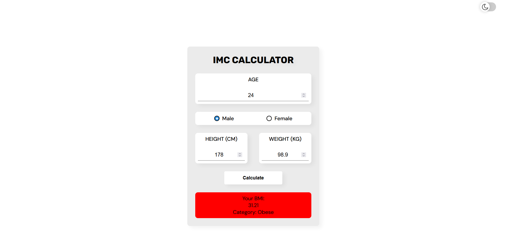
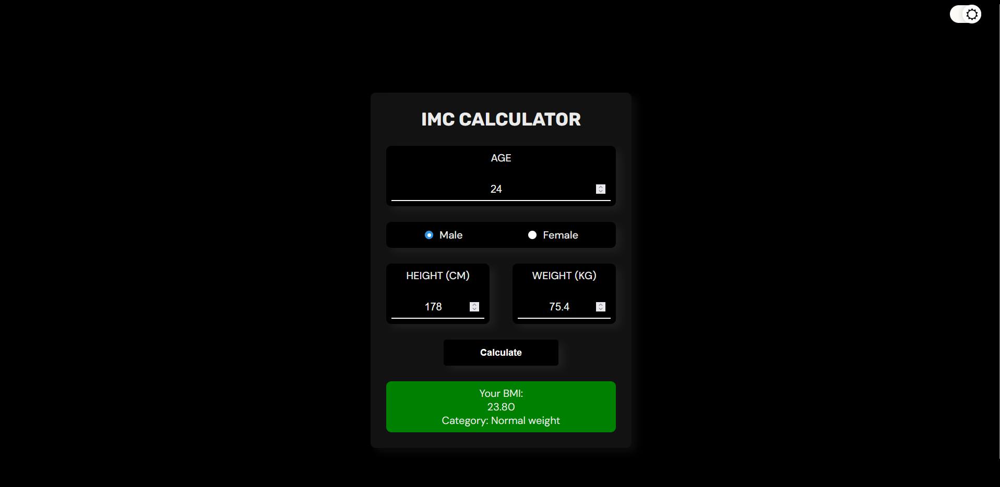

# 🧮 BMI Calculator

A responsive and themeable Body Mass Index (BMI) calculator built with HTML, CSS, and JavaScript.

---

## 💡Features

- 📥 Input for age, gender, height and weight
- 📊 Calculates BMI and displays category (underweight, normal, etc.)
- 🌓 Light and dark mode toggle
- 💅 Clean and responsive layout

---

## 🎨 Preview

### ☀️ Light Mode  

### 🌙 Dark Mode  

---

## 🚀 Live Demo

🔗 [Link to GitHub Pages](https://lwyz1912.github.io/bmicalculator/)

---

## 🛠️ Technologies

- HTML5
- CSS3
- JavaScript
